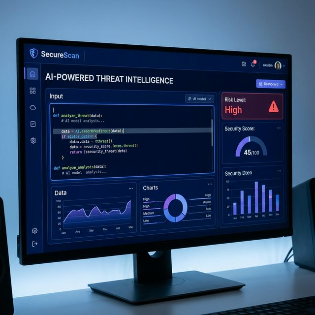

# SecureScan

**SecureScan** is an advanced, AI-powered security intelligence tool designed to analyze code, text, and system logs for potential vulnerabilities and threats. It provides real-time risk assessment, security scoring, and actionable insights to help developers and security professionals identify and mitigate issues.



## Key Features

*   **Multi-Modal Analysis**: capable of analyzing raw text, code snippets, and system logs.
*   **AI-Powered Detection**: Utilizes advanced LLMs to identify subtle security risks that traditional regex-based tools might miss.
*   **Real-Time Risk Scoring**: Instantly calculates a security score (0-100) and assigns a risk level (Low, Medium, High, Critical).
*   **Detailed Reporting**: Provides a breakdown of key issues, including their severity and specific details.
*   **Clean, Professional UI**: A modern, dark-themed interface focused on usability and clarity.

## Installation

1.  Clone the repository:
    ```bash
    git clone https://github.com/Harshaghera111/SecureScan.git
    ```
2.  Navigate to the project directory:
    ```bash
    cd SecureScan
    ```

## Usage

1.  Open `index.html` in your web browser.
2.  Select the type of content you want to analyze (Code, Text, or Logs).
3.  Paste your content into the input area.
4.  Click **Analyze Security**.
5.  View the detailed analysis results, including the security score and identified issues.

## Technologies Used

*   **HTML5 & CSS3**: For the structure and modern, responsive design.
*   **JavaScript (ES6+)**: Core application logic and DOM manipulation.
*   **AI Integration**: Built to interface with LLM APIs for deep analysis.

## Contributing

Contributions are welcome! Please feel free to submit a Pull Request.

## License

This project is open-source and available under the [MIT License](LICENSE).
